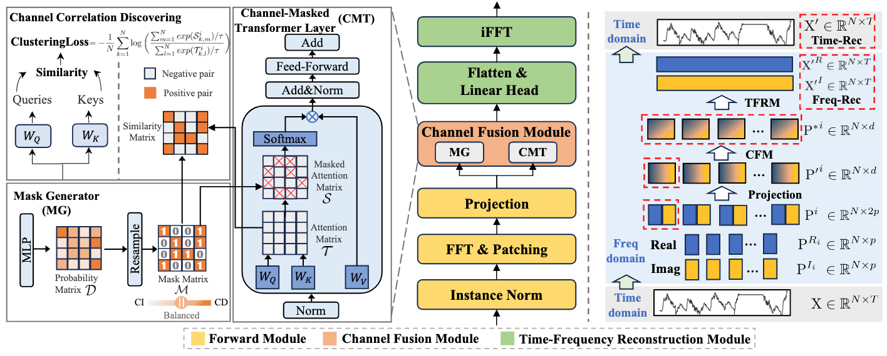
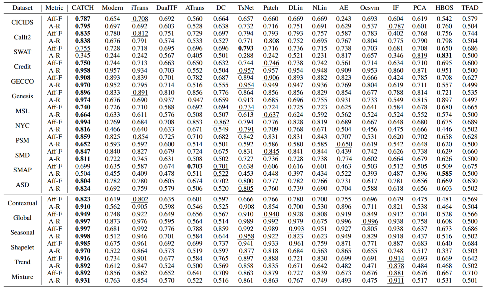

#  CATCH: Channel-Aware Multivariate Time Series Anomaly Detection via Frequency Patching

**This code is the official PyTorch implementation of our ICLR'25 paper: [CATCH](https://arxiv.org/pdf/2410.12261): Channel-Aware Multivariate Time Series Anomaly Detection via Frequency Patching.**

[](https://arxiv.org/pdf/2410.12261)  [](https://www.python.org/)  [](https://pytorch.org/)   

If you find this project helpful, please don't forget to give it a ⭐ Star to show your support. Thank you!

🚩 News (2025.6) The evaluation framework [TAB](https://arxiv.org/pdf/2506.18046) used in this study has been accepted by PVLDB 2025. Both the dataset and source code are available [here](https://github.com/decisionintelligence/TAB).

🚩 News (2025.1) CATCH has been accepted by ICLR 2025.

## Introduction

**CATCH**, a framework based on frequency patching, flexibly utilizing the channel correlations to reconstruct all the frequency spectrums in a fine-grained way to achieve remarkable detection accuracy. Technically,  we propose a **Channel Fusion Module** (CFM), which features a patch-wise **mask generator** and the masked-attention mechanism. Driven by a bi-level multi-objective optimization algorithm, the CFM is encouraged to iteratively discover appropriate patch-wise channel correlations and **cluster similar channels in the hidden spaces while isolate the adverse effects from irrelevant channels**, which provides both the **capacity and robustness** of the attention mechanism.

<div style="text-align: center;">
    
</div>


## Quickstart

### Installation

Given a python environment (**note**: this project is fully tested under python 3.8), install the dependencies with the following command:

```
pip install -r requirements.txt
```

### Data preparation

Prepare Data. You can obtained the well pre-processed datasets from [OneDrive](https://1drv.ms/u/c/801ce36c4ff3f93b/EVTDLHyvegpEn_Oxa6ZiuFIBjTsKk6m9JldUqWDqvrVCnQ?e=P2T3Vc) or [BaiduCloud](https://pan.baidu.com/s/1W7UoAWKZjoukSZ74FTipYA?pwd=2255). (This may take some time, please wait patiently.) Then place the downloaded data under the folder `./dataset`. 

### Train and evaluate model

- To see the model structure of CATCH,  [click here](./ts_benchmark/baselines/catch/CATCH.py).
- We provide the experiment scripts for CATCH and other baselines under the folder `./scripts/multivariate_detection`. For example you can reproduce a experiment result as the following:

```shell
sh ./scripts/multivariate_detection/detect_label/MSL_script/CATCH.sh

sh ./scripts/multivariate_detection/detect_score/MSL_script/CATCH.sh
```


## Results

Extensive experiments on 10 real-world datasets and 12 synthetic datasets demonstrate that CATCH achieves state-of-the-art performance. We show the main results of all the 10 real-world datasets, and report the mean results of the 6 types of synthetic datasets:

<div align="center">

</div>


## Setup for Running Baseline Models
If you want to test all baseline models, please refer to the Time Series Anomaly Detection Benchmark [TAB](https://github.com/decisionintelligence/TAB):


## Citation

If you find this repo useful, please cite our paper.

```
@inproceedings{wu2024catch,
  title     = {{CATCH}: Channel-Aware multivariate Time Series Anomaly Detection via Frequency Patching},
  author    = {Wu, Xingjian and Qiu, Xiangfei and Li, Zhengyu and Wang, Yihang and Hu, Jilin and Guo, Chenjuan and Xiong, Hui and Yang, Bin},
  booktitle = {ICLR},
  year      = {2025}
}

@inproceedings{qiu2025tab,
title      = {{TAB}: Unified Benchmarking of Time Series Anomaly Detection Methods},
author     = {Xiangfei Qiu and Zhe Li and Wanghui Qiu and Shiyan Hu and Lekui Zhou and Xingjian Wu and Zhengyu Li and Chenjuan Guo and Aoying Zhou and Zhenli Sheng and Jilin Hu and Christian S. Jensen and Bin Yang},
booktitle  = {Proc. {VLDB} Endow.},
year       = {2025}
}
```


## Contact

If you have any questions or suggestions, feel free to contact:
- [Xingjian Wu](https://ccloud0525.github.io/)  (xjwu@stu.ecnu.edu.cn)
- [Xiangfei Qiu](https://qiu69.github.io/) (xfqiu@stu.ecnu.edu.cn)

Or describe it in Issues.

